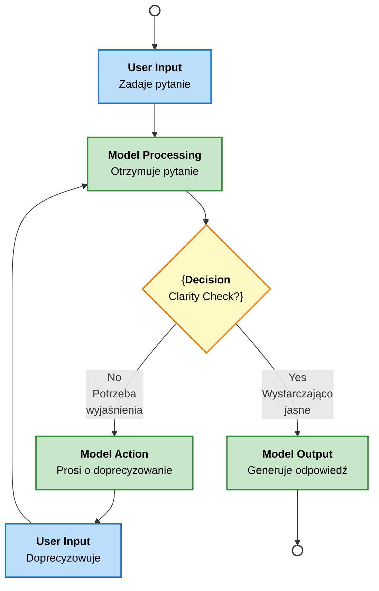

# Task 11: Reversed Control Flow Diagram

## Interactive Clarification Flow

This diagram describes the "reversed control flow" where the model can ask for clarification before providing a final answer using UML Activity Diagram notation.



## Flow Description

### Steps:

1. **User asks question** → Initial prompt from user
2. **Model receives** → Analyzes the question
3. **Clarity check** → Does model understand enough?
   - **No** → Ask for clarification
   - **Yes** → Generate answer
4. **Loop back** → If clarification needed, user responds and we re-analyze
5. **Final answer** → Model provides complete response

## Implementation Concepts

### Key Components:

- **Prompt clarification detection**: Model evaluates if the prompt is sufficiently clear
- **Control reversal**: Instead of immediately answering, model asks questions
- **Iterative refinement**: Loop continues until clarity threshold is met
- **Conversation history**: Maintain context across multiple exchanges

### Python Implementation Strategy:

```python
def interactive_conversation(user_prompt, model, max_clarifications=3):
    """
    Implements reversed control flow where model can ask for clarification.
    
    Args:
        user_prompt: Initial question from user
        model: LLM model instance
        max_clarifications: Maximum clarification rounds
    
    Returns:
        final_answer: Model's final response
    """
    conversation_history = [
        {"role": "user", "content": user_prompt}
    ]
    
    clarification_count = 0
    
    while clarification_count < max_clarifications:
        # Generate response from model
        response = model.generate(conversation_history)
        
        # Check if response is a clarification question or final answer
        if is_clarification_question(response):
            # Model is asking for clarification
            clarification_count += 1
            
            # Add model's clarification question to history
            conversation_history.append({
                "role": "assistant",
                "content": response
            })
            
            # Get user's clarification
            user_clarification = input("Your clarification: ")
            conversation_history.append({
                "role": "user",
                "content": user_clarification
            })
        else:
            # Model has provided final answer
            return response
    
    # If max clarifications reached, return current response
    return response

def is_clarification_question(response):
    """
    Detect if model response is a clarification question.
    Can be based on:
    - Keywords like "Could you clarify", "Do you mean", etc.
    - Response length/structure
    - Confidence scoring
    """
    clarification_keywords = [
        "clarify", "mean", "understand", "question", 
        "could you", "could you please", "exactly"
    ]
    
    return any(keyword in response.lower() for keyword in clarification_keywords)
```

## Design Patterns

### Option 1: System Prompt Based
Add explicit instruction to model's system prompt:
```
"If the user's question is unclear or ambiguous, ask for clarification 
before providing your answer. Ask specific, focused questions."
```

### Option 2: Post-Processing with Separate Model
Use a classifier to detect if main response is a clarification:
```python
is_clarification = classifier.predict(response)
```

### Option 3: Prompt Engineering
Use specific prompt structure:
```
"Respond with either:
1. [CLARIFY] followed by your clarification question, OR
2. [ANSWER] followed by your final answer"
```

## Use Cases

- **Customer support**: AI asks specific questions before resolving issues
- **Technical support**: Clarify system details before troubleshooting
- **Writing assistance**: Ask about tone, audience, purpose before rewriting
- **Data analysis**: Clarify requirements before running analysis
- **Legal advice**: Ask about specific circumstances before providing guidance

